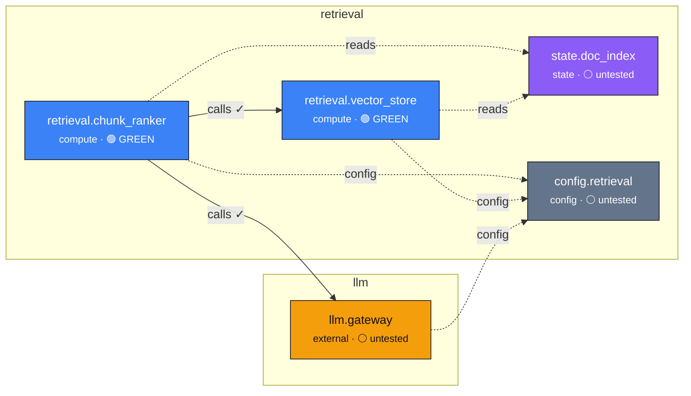
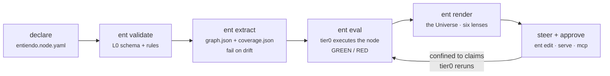
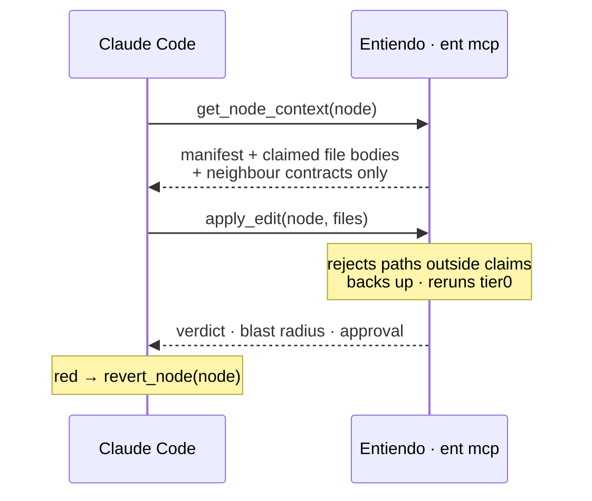

# Entiendo — steer your codebase like mission control

[](https://github.com/akashdatageek/Entiendo/actions/workflows/ci.yml)

> **The control plane for AI-built software.** Manifests hold the declared desired
> state; a reconciler continuously verifies reality against it; evals are the
> health probes; fingerprints are the versioned identities; and the Universe is
> the surface you steer through. **Human = operator, coding agent = workload,
> Entiendo = control plane.** Works *with* your IDE and your agent — it is the
> plane they operate under.

**When AI writes the code, the file tree stops being the right interface.** The
unit of work becomes the **unit** — a declared component with a task, a contract,
an eval, a **fingerprint**, and a history. Entiendo makes that unit the surface a
human steers through *and* the retrieval unit an AI edits through.

> **The law:** a boundary is a valid unit *iff it can be evaluated independently
> on given data.* Not evaluable alone → not a unit → boundary error. That single
> test is what makes this *control*, not decoration.

> Instrumentation at **build time**, not forensics after breakage. Sensors go in
> while you build, so "which part broke" is already answered when something turns
> red. Entiendo is a read-only observer — never in the request path.

What's implemented today is tracked in **[STATUS.md](./STATUS.md)** (the single
status source). The full specification is **[SPEC.md](./SPEC.md)** (the source of
truth), the vocabulary is **[LEXICON.md](./LEXICON.md)**, and the roadmaps are
**[PLAN_v3.md](./PLAN_v3.md)** (units → fingerprints → Bridge) and
**[PLAN_v4.md](./PLAN_v4.md)** (the rendered Universe — interiors, real lenses,
diff-first approval — now fully implemented). This README is the map to the
scaffold.

> **Naming:** v3 speaks of *units*, *fingerprints*, and *reflex / golden / judge*
> evals; the older *node* / *version* / *tier0–2* names still appear in code and
> some docs and mean the same things (the mechanical rename is a later phase). The
> manifest format — `entiendo.node.yaml`, `claims:`, `apiVersion: entiendo/v1` —
> is unchanged.

---

## Quickstart — under a minute to your first Universe

Measured on a clean virtualenv (2-core Linux container): install 8.7s, first
graph 0.2s, full eval pass 0.6s.

```bash
pip install entiendo            # or, from a checkout: pip install -e ".[dev]"

# try it on the bundled example
cp -r examples/refundly /tmp/refundly && cd /tmp/refundly
ent extract                     # → entiendo/graph.json + coverage, reconciled
ent eval --all                  # → every unit executes its reflex evals
ent dev                         # → the Universe on http://127.0.0.1:7373,
                                #   live-reloading as you edit
```

From there: click a unit → read its dossier → hit **Steer** and let a Claude
Code operator (`ent serve --operator`) make the change through the unit's
claims, with the verdict and blast radius surfacing in the map.

**Use it inside Claude Code** — the MCP server, the operator/retrofit skills,
and the boundary hook install as one plugin; see
**[docs/deploy-claude-code.md](./docs/deploy-claude-code.md)**:

```
/plugin marketplace add akashdatageek/Entiendo
/plugin install entiendo@entiendo-marketplace
```

**Platform support:** macOS and Linux are first-class. On Windows, the core
works with degraded guarantees — history locking falls back from `fcntl` to
`msvcrt`, and the eval sandbox skips POSIX rlimits (timeouts still apply) —
so **WSL2 is the recommended way to run Entiendo on Windows**. Nothing
crashes natively; you just lose the memory/CPU caps.

## Status: L0 → L5 + Phase 7 + the v4 Universe implemented

All six phases (SPEC.md §8), **Phase 7 (real evals)**, and the whole **v4 layer**
are implemented. The full loop works end to end: declare units → reconcile the
graph → instrument → **execute + eval** → record history → render the Universe →
steer + approve through the unit.

**What v4 added (PLAN_v4.md, H0–H5):** the render surface is now a single
navigable **Universe** — one canvas with a world-coordinate camera, `/`-search,
keyboard nav, a minimap, and group collapse — dressed in a celestial design
system, replacing the old six-tab layout. The lenses became *real*: **trace
playback** (a comet walks a recorded request's hops and halts red on a failed
one), a **timeline scrubber** over a real commit axis (replays a unit's
fingerprint against any past commit), and a **cost/budget overlay**. Agentic
units now **render their interior** — each tool a satellite on an orbit ring,
tethered across the border to the unit it crosses — and trace playback descends
into it, lighting each tool as the agent calls it. Finally, **diff-first
approval**: steering an approval-gated unit holds the change back as a
*proposal*, and the dossier shows the unified diff + behaviour delta + verdict
together with real Approve / Reject, while the map pulses a gold ring on any unit
awaiting sign-off.

```
$ ent validate            # schema + semantic checks (incl. restricted invariants)
$ ent init                # scaffolds entiendo/ (+ a starter manifest)
$ ent new <id> --task ... --fixture ... --expect ...   # fixture-first unit birth; refuses without the pair (the law)
$ ent extract             # graph.json + coverage.json; fails on drift; proposes entrypoints
$ ent eval <node>         # tier0 EXECUTES the node → GREEN/RED/UNTESTED/ERROR
$ ent eval --all --tier 1 # golden: minRuns + significance + budgets (the pre-merge gate)
$ ent bless <node>        # sign a golden dataset's content (humanBlessed, void on change)
$ ent baseline accept <n> # promote a pending baseline
$ ent snapshot            # record composite versions + verdicts to append-only history
$ ent render              # self-contained HTML map: six lenses + "executable N/M"
$ ent edit <node>         # scoped edit loop: context + boundary + verdict + approval
$ ent pin <n> model=<id>  # pin a fingerprint dimension; the fingerprint moves onto the Timeline
$ ent replay <n> --against <fp>  # golden metric now vs an old fingerprint, delta attributed by dimension
$ ent retrofit <root>     # infer nodes in an unmanaged repo → staged manifest proposals
$ ent serve               # the Universe: click a unit, steer it via Claude Code, watch reflex
```

> **The one-line test (Phase 7 §15):** break `ranker.py` and run
> `ent eval retrieval.chunk_ranker`. It goes **RED** and names the failed
> invariant with the real numbers (`len(output.chunks)=2 <= input.k=1`). That is
> the difference between an instrument and a diagram — see [`docs/phase7.md`](./docs/phase7.md).

What **is** real today:

- **[`SPEC.md`](./SPEC.md)** — the complete specification (v3).
- **[`schemas/node.schema.json`](./schemas/node.schema.json)** — the manifest
  JSON-Schema. This is *the contract for the entire system* (SPEC.md §12).
- **`ent validate` / `ent init`** — L0 boundaries: schema conformance plus the
  semantic rules (id uniqueness, `$ref` resolution, claim existence, the
  `humanBlessed` gate on tier1 golden sets). See `src/ent/validation.py`.
- **`ent extract`** — L1 reconciler: AST import analysis derives actual edges and
  checks them against declared `dependencies`. Undeclared edges are drift and
  fail the build (Invariant 5); it emits `graph.json` + `coverage.json`. See
  `src/ent/extractor.py`.
- **`ent eval` + `@ent.node()`** — L2 instrumentation + **Phase 7 real evals**:
  the decorator emits an OTel-compatible span carrying `entiendo.node_id` (and
  `ent.record()` meters cost/tokens), never in the request path (Invariant 2).
  **tier0 now executes the node** over fixture rows in isolation (dependency calls
  served from stubs; any unstubbed call is a `TIER0_IO_VIOLATION`) and evaluates
  the real invariants against real output via a restricted AST evaluator (no
  `eval`/`exec`) → GREEN/RED/UNTESTED/ERROR. **tier1** replays `minRuns` times,
  scores with the metric, and applies anti-flicker statistics
  (WITHIN_BAND/REGRESSED/IMPROVED/UNSTABLE) + budgets (DEGRADED); `humanBlessed`
  is enforced by a content signature. See `src/ent/evals/`, `src/ent/invariants.py`,
  `src/ent/testing.py`, `docs/phase7.md`.
- **`ent snapshot` + `ent render`** — L3/L4: `snapshot` records composite
  versions (code/prompt/config/model) + tier0 verdicts to an append-only history
  log (version events dedup, so the timeline shows *changes*); `render` builds the
  **Universe** — one self-contained, navigable canvas (camera, search, minimap,
  celestial design) whose **six lenses** are all real: structure (kind/group),
  flow (edge kinds + traffic), **trace** (a comet plays a recorded request's hops
  and descends into agentic interiors), health (verdict colour, matches
  `ent eval`), **timeline** (a scrubber over the real commit axis that replays
  fingerprints), and blast radius (dependents ranked by coupling). Agentic units
  render their `interior` as orbiting, tethered tool satellites. Record a request
  with `history.capture_trace(root, trace_id=...)`. Read-only, never in the
  request path (Invariant 2). See `src/ent/render.py`, `src/ent/universe.html`,
  `src/ent/history.py`, `src/ent/version.py`.
- **`ent edit`** — L5 scoped edit loop: assembles a context of only the node's
  claimed file bodies + immediate neighbours' contracts (no bodies) + recent
  evals + baseline — the AI edits through the node, not the repo (Invariant 8).
  `--changed` enforces the claim boundary, reruns tier0, shows blast radius, and
  applies the approval gate. See `src/ent/editloop.py`.
- **`ent retrofit`** — the §12 v2 path: infers node boundaries in an *unmanaged*
  repo (directory grouping, kind from extensions, deps from static imports,
  entrypoint from a lone public function) and stages one manifest proposal per
  node for node-by-node review (`--accept`). Semi-automated migration, never a
  silent scan. `examples/legacy/` is the demo input. See `src/ent/retrofit.py`.
- **`ent serve`** — the interactive surface: the Universe over a localhost web app
  (stdlib backend, self-contained frontend). Select a unit, see its scoped
  context, run tier0/tier1, and **Steer** it in natural language — edited **only
  within the unit's claims**, tier0 reruns, verdict + blast radius surface live,
  with one-click **Revert**. An approval-gated unit's change is held as a
  **proposal** you Approve / Reject from the diff. The workload is either an LLM
  directly (`pip install -e '.[serve]'` + an API key) or **Claude Code via the
  Bridge** (steer → `await_steering`/`post_verdict`, the `entiendo-operator`
  skill). The map stays read-only (Invariant 2); only steer / approve / revert
  write. See `src/ent/server.py`, `src/ent/steering.py`, `src/ent/agent.py`,
  `docs/edit-surface.md`, `docs/bridge.md`.
- **[`examples/greenfield/`](./examples/greenfield/)** — a five-node example
  project laid out the Entiendo way. Full loop:
  `cd examples/greenfield && ent validate && ent extract && ent snapshot && ent render && ent edit retrieval.chunk_ranker`.
- **[`examples/refundly/`](./examples/refundly/)** — the reference project and the
  v4 demo: a support-refund **pipeline of six units** — `parse_email` (compute) →
  `orders` (state) → `policy` (config) → `decide` (the **agentic unit**) →
  `gateway` (external) → `ledger` (state). `refundly.decide` has an `interior` (a
  five-tool registry — parse / order_lookup / read_policy / issue_refund /
  write_ledger, each crossing to another unit — plus `maxSteps`) and a
  **trajectory eval** — a reflex check that the *path* is right (`order_lookup`
  before `issue_refund`, no tool outside the registry), not just the answer.
  Border-crossing tools are reconciled against declared edges (`ent.guard`
  enforces the registry at runtime); `refundly.gateway` is `irreversible` +
  approval-gated, so steering it produces a **proposal** you approve from the
  diff. Its committed traces (including a bad-order run where the refund is issued
  before the order is verified) drive trace playback. See SPEC §14.
- **`src/ent/`** — the package: CLI, one module per layer.

---

## What a project looks like

Point Entiendo at a repo and every declared component becomes a **node** on one
topology you steer through — not a folder in a tree. This is
[`examples/greenfield/`](./examples/greenfield/): five nodes, reconciled at 100%
coverage. Run `cd examples/greenfield && ent extract` and this is the graph it
derives:



**Reading the map:** colour is the node **kind** (blue `compute` · violet `state`
· slate `config` · amber `external`). A **solid** arrow is an edge the extractor
*verified* against a real import (`✓`); a **dashed** arrow is declared but not
statically provable (`reads`/`config`). Health is the node's tier0 verdict —
🟢 GREEN means the node **executed** and its invariants held, ⚪ means no
executable eval yet. An undeclared import would fail `ent extract` naming both
nodes (Invariant 5), so what you see is guaranteed to match the code.

### The rendered surface — the Universe (`ent render`)

`ent render` builds a **self-contained HTML page** (inline CSS/JS, no build step,
read-only) — the **Universe**: one navigable canvas, not a wall of tables. Pan
and zoom with a world-coordinate camera, `/` to search, arrow keys to walk units,
a minimap for the whole system, and groups you collapse at scale. The six
**lenses** don't switch pages — they change what the *same* canvas shows:

```
┌──────────────────────────────────────────────────────────────────────────┐
│  ✦ Entiendo · Universe            [ structure ][ flow ][ trace ]           │
│  5 units · 7 edges · coverage 100% · executable 2/5 · reconciled ✓  @a1b2c │
│                                          ┌─────────── dossier ───────────┐ │
│         ( ranker )────✓───▶( vstore )    │ retrieval.chunk_ranker  🟢     │ │
│            │  ╲                          │ What it does · Task · Verdict  │ │
│            ✓   ╲config                   │ Contract: len(chunks) ≤ k      │ │
│            ▼    ▼                         │ Budget · Fingerprint · Edges   │ │
│        ( gw )  ( cfg )   ○ doc_index      │ [ Steer ][ Revert ][ Approve ] │ │
│         ▲ minimap ▫                      └────────────────────────────────┘ │
└──────────────────────────────────────────────────────────────────────────┘
```

- **Structure** — kind + group; the map you read first.
- **Health** — recolours every unit by its tier0 verdict; it calls the same
  `run_tier0` as `ent eval`, so the colour matches by construction (🟢 executed +
  invariants held, ⚪ no executable eval).
- **Flow** — edge direction with per-edge kind labels and per-unit traffic volume.
- **Trace** — pick a recorded request and a **comet walks its hops** in order,
  annotating each with latency + cost; a failed hop halts it and pulses red. Over
  an agentic unit the comet **descends into the interior**, lighting each tool as
  the agent calls it — so an out-of-order call shows even when the answer is right.
- **Timeline** — a **scrubber over the real commit axis**; drag it and a unit's
  fingerprint replays against that past commit, the changed dimension attributed
  (code / prompt / config / model).
- **Blast radius** — select a unit → its transitive downstream dependents light
  up, ranked by contract coupling.

Agentic units aren't opaque orbs: their `interior` renders as **satellites on an
orbit ring**, each tethered across the border to the unit its tool crosses (the
ring dashes when the registry isn't enforced).

### Steer + approve on the canvas — `ent serve`

`ent serve` puts the Universe behind a localhost web app and turns the dossier
into a control panel. Select a unit → **Steer**: describe a change in English. The
change is made **within the unit's claims**, tier0 reruns, and the verdict + blast
radius surface live, with one-click **Revert**. Two ways the workload edits: an
LLM directly (`.[serve]` + an API key), or **Claude Code as the operator** — the
steer request lands on a file-based **Bridge** queue (`await_steering` →
`get_node_context` → `apply_edit` → `post_verdict`, the `entiendo-operator`
skill), so the map steers the same agent you already code with.

For an **approval-gated** unit (`approval.required`), the change is not applied
live — it is held back as a **proposal**. The dossier shows the change you'd be
approving: the **unified diff, the behaviour delta, and the after-verdict
together**, with real **Approve** / **Reject**. On the map, any unit with a
proposal waiting pulses a gold ring.

```
┌ Universe ─────────────────────────┬─ refundly.gateway ────────────────────┐
│                                    │ external · irreversible · approval ✋  │
│   parse ▶ orders ▶ policy          │ ── Proposal · awaiting approval ──     │
│              │                     │ clamp refund to order amount · 🟢      │
│         ( decide )  ◜orbit◝        │ behaviour Δ  0.91 → 0.94 (IMPROVED)    │
│           tools: order_lookup…     │ ┌ src/gateway/pay.py ────────────┐    │
│              │                     │ │ - amount = req.amount          │    │
│         ((gateway))✦ ← pulsing     │ │ + amount = min(req.amount, ord)│    │
│              │      gold ring      │ └────────────────────────────────┘    │
│           ( ledger )               │        [ Approve ]   [ Reject ]        │
└────────────────────────────────────┴────────────────────────────────────────┘
```

The map stays read-only (Invariant 2); only the steer / approve / revert
endpoints write, and only inside the claims. A red edit is **blocked**, the
pre-edit content is backed up for revert, and an approval gate is never bypassed —
Reject leaves the working tree untouched.

---

## How you work with it

Two ways in, same guarantees. Either you drive the loop from the **CLI**, or an
**AI edits through the node** (`ent serve`, or `ent mcp` with Claude Code).

### The loop



The manifest **is** the retrieval index: an edit loads only the node's claimed
file bodies + its immediate neighbours' contracts (no bodies) — never the whole
repo (Invariant 8). Every edit is boundary-checked, re-evaluated, and gated
(`ready-to-merge` / `awaiting-signoff` / `blocked`) before it counts as done.

### Editing through the node with Claude Code (`ent mcp`)

Register Entiendo as an MCP server (`.mcp.json` → `{ "command": "ent", "args":
["mcp"] }`) and Claude Code reads and writes *through the node*, not the file
tree:



A quick tour, end to end:

```bash
pip install -e '.[dev,mcp]'
cd examples/greenfield
ent validate                        # L0: manifests conform
ent extract                         # L1: graph.json + coverage.json (no drift)
ent eval retrieval.chunk_ranker     # L2/Phase 7: executes → 🟢 GREEN
ent render && open entiendo/render.html  # L4: the six-lens map above
ent serve                           # L5: click-and-edit surface (needs [serve])
ent mcp                             # L5: same surface as MCP tools for Claude Code
```

---

## The unit

Everything hangs off one schema. A unit is declared by an `entiendo.node.yaml`
colocated with the code it owns (the filename keeps the `node` spelling for
back-compat — see [LEXICON.md](./LEXICON.md) → Compatibility):

```yaml
apiVersion: entiendo/v1
kind: Node
id: retrieval.chunk_ranker      # stable, globally unique
nodeKind: compute               # compute | state | schema | config | external | pipeline
owner: mehar                    # human accountable, not the AI
claims: [src/retrieval/ranker.py, src/retrieval/prompts/rank_v3.md]
contract:
  invariants: ["len(output.chunks) <= input.k"]
  sideEffects: none
dependencies: { calls: [retrieval.vector_store, llm.gateway], reads: [state.doc_index] }
evals:
  tier0: [{ type: schema_validation }, { type: invariant_check }]
```

See the fully-annotated version in
[`examples/greenfield/src/retrieval/entiendo.node.yaml`](./examples/greenfield/src/retrieval/entiendo.node.yaml)
and the field-by-field reference in [`docs/manifest.md`](./docs/manifest.md).

---

## CLI

| Command | Layer | Does |
|---|---|---|
| `ent init` | L0 | scaffold `entiendo/` + a first unit manifest |
| `ent new <id>` | L0 | fixture-first unit birth (refuses without a fixture/expect pair) |
| `ent validate` | L0 | validate manifests against the schema |
| `ent extract` | L1 | emit `graph.json` + `coverage.json`; fail on drift |
| `ent eval <unit>` | L2 | run a unit's evals — reflex (default) / golden / judge |
| `ent bless` / `ent baseline` | L2 | sign a golden dataset / promote a baseline (human only) |
| `ent snapshot` | L3 | record composite fingerprints + verdicts to history |
| `ent render` | L4 | the Universe render surface (six lenses, self-contained HTML) |
| `ent pin` / `ent replay` | L4 | pin a fingerprint dimension / replay a metric against an old one |
| `ent edit <unit>` | L5 | scoped edit loop: context → boundary → verdict → approval |
| `ent serve` | L5 | the Universe live: steer + approve on the canvas |
| `ent mcp` | L5 | the same surface as MCP tools for Claude Code |
| `ent retrofit <root>` | — | infer units in an unmanaged repo → staged proposals |
| `ent doctor` | — | self-diagnose the environment + project (deps, key, schema, reconcile) |
| `ent fixtures <unit>` | — | propose tier0 smoke fixtures for a unit from recorded traces |
| `ent ci` | — | one gate: validate + reconcile + eval (CI / pre-commit) |

> **Lexicon:** the CLI, the Universe, and these docs speak of **units**,
> **fingerprints**, and **reflex / golden / judge** evals. The *format* is
> unchanged — `entiendo.node.yaml`, `claims:`, `apiVersion: entiendo/v1`,
> `kind: Node` — and old forms (`--node-id`, `--tier 0/1/2`) keep working. See
> [LEXICON.md](./LEXICON.md).

All layers are implemented (L0 → L5 + Phase 7 + the v4 Universe); see the build
order below.

---

## Architecture (L0 → L5)

Strictly separable layers, each testable alone, built in order
(SPEC.md §3, §8). See [`docs/architecture.md`](./docs/architecture.md) and
[`docs/build-order.md`](./docs/build-order.md).

```
L0  Manifest & schema      declaration + validation          src/ent/manifest.py, schemas/
L1  Extractor / reconciler graph.json + coverage.json         src/ent/extractor.py, version.py
L2  Instrumentation        @ent.node() spans; eval runner     src/ent/instrument.py, evals/
L3  History store          append-only versions + evals       src/ent/history.py
L4  The Universe           one canvas, six real lenses         src/ent/render.py, universe.html
L5  Steer + approve        unit → context → edit → verdict     src/ent/editloop.py, server.py, steering.py
```

---

## Repo layout

```
Entiendo/
  SPEC.md                     the specification (source of truth)
  README.md                   this file
  pyproject.toml              package + `ent` console script
  schemas/
    node.schema.json          manifest contract (JSON-Schema)
  src/ent/                    the tool
    cli.py                    argparse entry; one file per subcommand under commands/
    commands/                 init, new, validate, extract, eval, bless, baseline,
                              snapshot, render, pin, replay, edit, serve, mcp,
                              retrofit, doctor, fixtures, ci
    manifest.py               L0  unit model: discover, load, Node
    schema.py                 L0  schema load + validator
    validation.py             L0  schema + semantic checks
    extractor.py              L1  reconciler (AST edges vs declared deps; drift = fail)
    version.py                L1/L3 composite fingerprinting (code/prompt/config/model)
    instrument.py             L2  @ent.node() decorator + ent.guard registry gate
    evals/, invariants.py     L2  tiered eval runner + restricted-AST invariants
    history.py                L3  append-only versions/evals/traces store
    render.py, universe.html  L4  the Universe: one canvas, six lenses, interiors
    editloop.py               L5  scoped context + boundary + verdict + behaviour delta
    server.py, agent.py       L5  ent serve backend + the editing model
    steering.py, mcp_server.py L5 the Bridge (steer queue → operator → proposal/verdict)
    replay.py                 L4  fingerprint replay for the Timeline scrubber
  examples/greenfield/        a five-unit example project (the MVP walkthrough)
  examples/refundly/          the 6-unit agentic pipeline + v4 demo (interiors, approval)
  docs/                       architecture, build order, manifest, edit-surface, bridge
  tests/                      the suite (251 tests, ~3s)
```

---

## Develop

```bash
pip install -e ".[dev]"     # editable install; provides the `ent` command
ent --version
pytest                       # the full suite (251 tests, ~3s)
```

Guiding invariants (SPEC.md §2): the map is generated never drawn; Entiendo is a
read-only observer, never in the request path; no node without a contract, no
contract without a tier-0 eval; every file is claimed exactly once or explicitly
unclaimed; manifests are verified, not trusted; secrets are never rendered.
